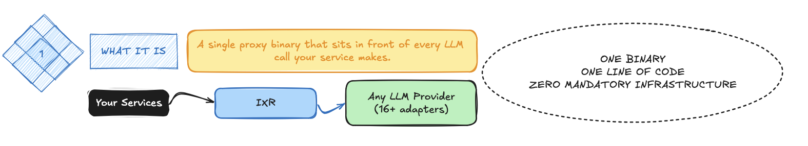
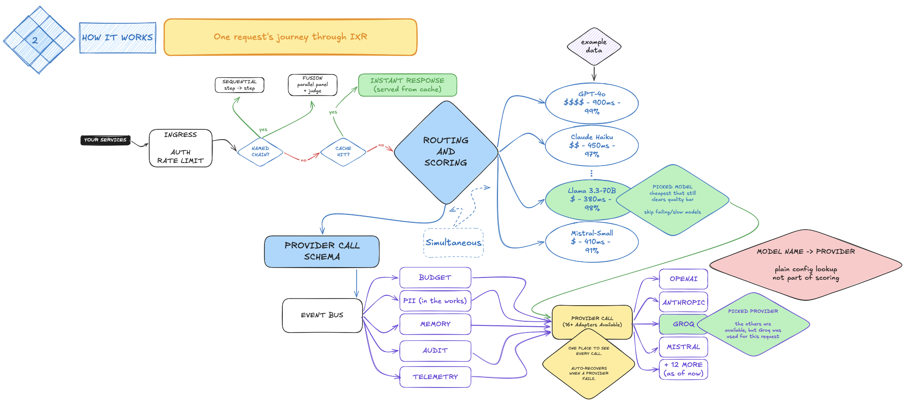
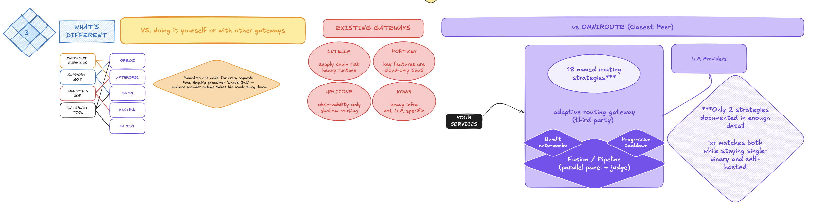
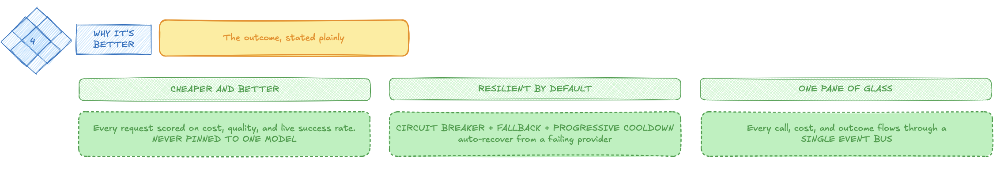

# ixr

A tiny, fast, embeddable inference proxy written in Go.

[](LICENSE)
[](https://pkg.go.dev/github.com/YashVishwas/ixr)

---

## what it is

ixr sits in front of every LLM call your service makes. you import it. you start it. you point your existing openai/anthropic client at it. nothing else changes.

every call now flows through a layer that is **schema-aware, observable, and extensible** — so any intelligence (security, finops, governance, adaptive routing) can be built on top of it without touching the calling service ever again.

## quickstart — 60 seconds

**path 1: embed in a Go service**

```go
import ixr "github.com/YashVishwas/ixr/pkg/ixr"

func main() {
    go ixr.Start() // that's it.
}
```

point your existing client at `http://localhost:7000` — nothing else changes:

```python
client = OpenAI(base_url="http://localhost:7000")
```

**path 2: run as a binary**

```bash
# build once
go build -o ixr ./cmd/ixr

# run with a config file, or just env vars
./ixr --config ixr.yaml
OPENAI_API_KEY=sk-... ./ixr
```

**path 3: docker**

```bash
docker build -t ixr .
docker run -p 7000:7000 -e OPENAI_API_KEY=sk-... ixr
```

**config (minimal)**

```yaml
# ixr.yaml
server:
  port: 7000

providers:
  openai:
    api_key: ${OPENAI_API_KEY}
  anthropic:
    api_key: ${ANTHROPIC_API_KEY}
```

`ixr.yaml` also configures auth, rate limits, per-tenant budgets, sessions, and model chains — see [docs/CONFIG.md](docs/CONFIG.md) and [demo-ixr.yaml](demo-ixr.yaml) for a fully-populated example.

## architecture









see [docs/ARCHITECTURE.md](docs/ARCHITECTURE.md) for the full layered model.

## what ixr does for every call

| capability | what it means |
|---|---|
| **adaptive routing** | `model: "auto"` (or an `X-IXR-Intent` header) picks the model by live cost/latency/success-rate scoring, with epsilon-greedy/UCB bandits and shadow routing to test new models on real traffic without exposing them to callers |
| **fallback + retry** | every call goes through retry-with-backoff and a fallback chain — a failing model doesn't fail the request, it escalates to the next-best one |
| **circuit breaker** | per-model Closed → Open → HalfOpen state machine trips on sustained failure and sheds load before it cascades |
| **response cache** | SHA-256 exact-match cache with LRU eviction + TTL — identical calls skip the provider entirely |
| **cost tracking + budgets** | every response is priced against a real model pricing table; hierarchical org → team → user budget caps gate requests before they're sent |
| **model chains** | a named chain (`fast-refine`, `debate`, ...) runs several models in sequence, each step's reply feeding the next — configured in `ixr.yaml`, no code |
| **sessions** | multi-turn conversation history keyed by `X-IXR-Session-ID`, in-memory or persisted to disk |
| **user memory** | facts extracted from conversation turns are stored per user and injected into future requests as context |
| **streaming** | SSE streaming on every provider, including chains |
| **tool calling** | `Tool`/`ToolCall`/`ToolChoice` forwarded and parsed on every adapter |
| **multimodal input** | image content alongside text, translated per-provider |
| **auth** | API key, JWT, and mTLS, hot-reloadable without a restart |
| **rate limiting** | sliding-window limiter, per-tenant request and token quotas |
| **observability** | OpenTelemetry tracing, Prometheus metrics on `GET /metrics`, structured JSON-lines call log |
| **multi-tenant identity** | every request resolves to a tenant/team/user, propagated through routing, budgets, and telemetry |

all of it is opt-in and additive — a caller that does nothing differently gets the same OpenAI-shaped response it always did.

## supported providers

| provider | notes |
|---|---|
| OpenAI | `gpt-*`, `o1`, `o3` |
| Anthropic | `claude-*` |
| Google | Gemini and Gemma |
| Groq | `llama*` |
| Cerebras | `gpt-oss*`, `qwen3*`, `llama-4-maverick` |
| Mistral | `mistral-*`, `codestral`, `magistral`, `devstral` |
| DeepSeek | `deepseek*` |
| Zhipu | `glm-*` |
| SambaNova | select Llama/DeepSeek/Gemma models |
| GitHub Models | `openai/*` |
| OpenRouter | any `org/model` id |
| AWS Bedrock | raw SigV4, no AWS SDK dependency |
| Ollama, llama.cpp, generic OpenAI-compatible | local/self-hosted models |

routing is by model-name prefix, or hand the decision to the scoring engine with `model: "auto"`. see [docs/ROUTING.md](docs/ROUTING.md).

## endpoints

- `POST /v1/chat/completions` — streaming and non-streaming, auth + rate limit + budget + memory + session + cache in front of it
- `POST /v1/embeddings`
- `POST /v1/images/generations`
- `GET /v1/schema` — JSON Schema for every public type (also published as `schema/ixr.proto` and `schema/ixr.schema.json` for non-Go consumers)
- `GET /metrics` — Prometheus

routing/scoring behavior is opt-in per request via headers or body — a caller that sends neither gets phase-1 deterministic prefix routing:

```
X-IXR-Intent: reasoning
X-IXR-Max-Cost: 0.01
X-IXR-Max-Latency: 1500
X-IXR-Quality: high
X-IXR-Session-ID: ...
X-IXR-UserID: ...
X-IXR-TenantID: ...
```

see [docs/ROUTING.md](docs/ROUTING.md) and [docs/ADAPTIVE.md](docs/ADAPTIVE.md).

## writing your first plugin

```go
package main

import (
    "context"
    "encoding/json"
    "log/slog"

    "github.com/YashVishwas/ixr/pkg/plugin"
    "github.com/YashVishwas/ixr/pkg/schema"
)

type CostLogger struct{}

func (c *CostLogger) Name() string { return "cost-logger" }

func (c *CostLogger) OnEvent(ctx context.Context, ev *schema.CallEvent) error {
    b, _ := json.Marshal(ev.Cost)
    slog.Info("call cost", "model", ev.Model, "cost", string(b))
    return nil
}

// register: pass to ixr.Start(ixr.WithPlugins(&CostLogger{}))
```

under 30 lines. no forks. every `CallEvent` (model, cost, latency, tokens, error) flows to every registered plugin, asynchronously, off the request's critical path. see [docs/PLUGINS.md](docs/PLUGINS.md) for more.

ixr ships with reference plugins in `plugins/`: `audit-log`, `telemetry`, `budget`, `memory`, `banditreward`, `token-usage`.

## non-negotiables

1. **one line of code to insert** — anything more = failure
2. **one binary to run** — no container required, no helm, no sidecar mesh
3. **zero refactor in the calling service** — existing openai/anthropic sdks just work
4. **schema-first** — every call is a typed struct, exported on a bus
5. **extensible without forks** — plugins are go interfaces, loaded at startup
6. **routing that learns** — after enough traffic, routing gets smarter automatically
7. **opensource by default** — Apache 2.0, signed releases, public roadmap

## project status

ixr is pre-1.0 and under active development. see [CHANGELOG.md](CHANGELOG.md) for what's shipped in each release, and [docs/rfc/](docs/rfc/) for open gaps being worked through before a 1.0 tag.

releases are signed (cosign) with an SBOM (syft) and pass `govulncheck` in CI — see `.github/workflows/`.

## license

Apache 2.0 — see [LICENSE](LICENSE).
